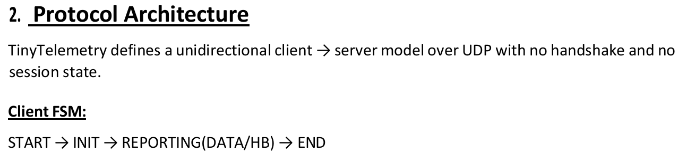
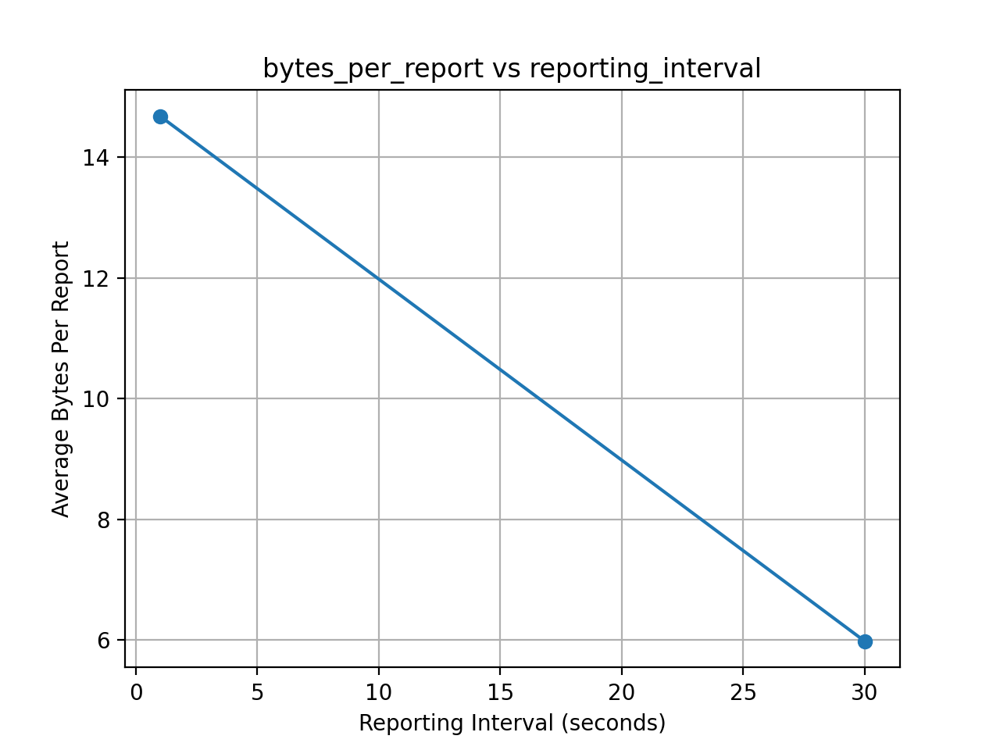
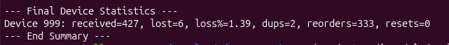
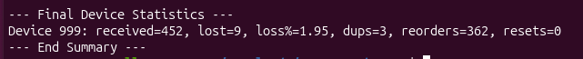

# 🛰️ TinyTelemetry: Efficient IoT Protocol over UDP

[](https://opensource.org/licenses/MIT)
[](https://www.python.org/downloads/)
[](https://eng.asu.edu.eg/)

---

## 🚀 Killer Description

**TinyTelemetry** is a high-performance, lightweight telemetry protocol engineered for **real-world IoT constraints**.

⚡ Built on **UDP**, it eliminates connection overhead and delivers **fast, predictable data transmission**  
📉 Designed to **operate under packet loss and jitter** without retransmissions  
🧠 Smart server-side logic reconstructs missing data using **interpolation instead of reliability overhead**

> 💡 *This project demonstrates how intelligent protocol design can outperform traditional TCP-based telemetry in constrained environments.*

---

## 📖 Table of Contents
* [Overview](#overview)
* [Architecture Diagram](#architecture-diagram)
* [Protocol Architecture](#protocol-architecture)
* [Key Features](#key-features)
* [Experimental Results](#experimental-results)
* [Getting Started](#getting-started)
* [Reproducing Analysis](#reproducing-analysis)
* [Project Contributors](#project-contributors)
* [Support & Feedback](#support--feedback)

---

## 🔍 Overview

Traditional telemetry protocols rely on TCP, which introduces:
- ❌ Connection setup delays  
- ❌ Retransmission overhead  
- ❌ Unpredictable latency (jitter)  

**TinyTelemetry solves this by:**
- Using **stateless UDP communication**
- Minimizing packet size (12-byte header)
- Offloading reliability to **intelligent server-side processing**

---

## 🖼️ Architecture Diagram

<p align="center">
  <br>
  <b>Protocol Workflow</b>
</p>

<p align="center">
  <br>
  <b>Client Finite State Machine</b>
</p>

### 🧩 System Architecture (Concept)

```
+-------------+        UDP Packets        +-------------+
|  IoT Client |  ---------------------->  |   Server    |
| (Sensor)    |                           | (Collector) |
+-------------+                           +-------------+
       |                                         |
       |  DATA / HB / INIT packets               |
       |                                         |
       v                                         v
  Local Buffer                          Data Processing Engine
                                        - Loss Detection
                                        - Interpolation
                                        - Anomaly Detection
                                        - Logging & Analysis
```

---

## 🏗️ Protocol Architecture

TinyTelemetry follows a **Stateless Unidirectional Client–Server Model**.

### 🔄 Client FSM

```
START → INIT → REPORTING (DATA / HB) → END
```

---

### 📦 Message Structure (12-Byte Header)

| Field | Size | Description |
|------|------|------------|
| **Ver/MsgType** | 1 Byte | Version + Message Type |
| **DeviceID** | 2 Bytes | Unique sensor ID |
| **SeqNum** | 4 Bytes | Sequence tracking |
| **Timestamp** | 4 Bytes | Synchronization |
| **Flags** | 1 Byte | Batching & checksum |

---

## ✨ Key Features

- 📦 **Batching (Up to 31 readings)** → Reduces overhead  
- 📉 **Loss Handling via Interpolation** → No retransmission needed  
- 🚨 **Anomaly Detection** → Detect duplicates & gaps  
- 🔐 **Optional Checksum** → Lightweight data integrity  

---

## 📊 Experimental Results

Simulated using Linux `netem`.

### 📈 Batching Efficiency
<p align="center">
  
</p>

### 🌐 Network Resilience
- 5% Packet Loss  
- 100ms Jitter  

✔ Successful loss detection  
✔ Smooth data reconstruction  

<p align="center">
  
  
</p>

---

## 🚀 Getting Started

### Prerequisites
- Python 3.8+
- Linux (recommended for `netem`)

---

### ⚙️ Usage

1. **Start Server**
   ```bash
   python src/server.py
   ```

2. **Start Client**
   ```bash
   python src/client.py --ip 127.0.0.1 --device 99 --interval 1.0
   ```

3. **Run Tests**
   ```bash
   python src/udp_tester_all.py
   ```

---

## 🧪 Reproducing Analysis

```bash
python src/analyze_results.py
```

Uses:
- Pandas
- Matplotlib

---

## 👥 Project Contributors

This project was developed by **Team 34**  
*Faculty of Engineering – Ain Shams University*

| Name | ID | Role |
|------|----|------|
| Abdelrahman Adel 🧑🏻‍💻 | 23P0144 | Protocol Design & Team Lead |
| Monzer Mahmoud 🧑🏻‍💻 | 23P0122 | Network Emulation & Testing |
| Omar Ahmed Abouraia 🧑🏻‍💻 | 23P0100 | Data Analysis & Plotting |
| Hossam Osama 🧑🏻‍💻 | 23P0010 | Server-side Logic & Interpolation |
| Zeina Reda 👩🏻‍💻 | 23P0181 | Documentation & Mini-RFC |
| Logine Mohamed 👩🏻‍💻 | 23P0187 | Quality Assurance & Validation |


---

### 🎓 Supervision
- Prof. Ayman Bahaa  
- Dr. Kareem Emara  

---

## 🌟 Support & Feedback

⭐ **Give it a Star** to support the project!
💡 **Have suggestions or found a bug?**  
- 🐛 Open an issue for bugs
- Or reach out directly using the links below
 

## 📬 Contact

<p align="center">

<a href="mailto:omara862005@gmail.com?subject=TinyTelemetry%20Feedback&body=Hi%20Eng.%20Omar%20Abouraia,%0A%0AI%20would%20like%20to%20share%20some%20feedback...">
  
</a>

<a href="https://www.linkedin.com/in/omarabouraia/">
  
</a>

<a href="https://github.com/OmarAbouraia">
  
</a>

</p>

---

## 📜 License

MIT License
